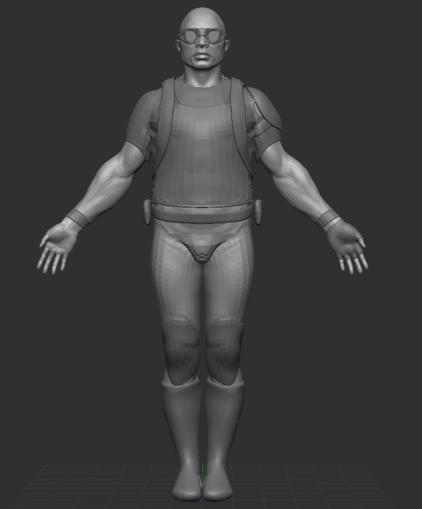

# 23.04.18. 3D 인하우스 모델러 인터뷰

---

작성자: 김영중

작성일: 23.04.19.

정리본

---

## 인터뷰 대상

[성함]: 3D 모델러, 33세, 경력 5년차

- 3D 기반 영상 제작 학원 강사
- 현 넷마블 3D 게임 캐릭터 모델러 (Sculpt + Texture)
    
    : 아스달 연대기(드라마 IP 기반 MMORPG) 프로젝트 참여 중
    

하주호: Technical Artist, 31세, 경력 7년차

- Post Production 3D Modeling 업무 수행, 광고 CG 제작 부서
- (주)룩댓[[page](https://www.nicebizinfo.com/ep/EP0100M002GE.nice?kiscode=OT6907)]에서 텍스처, 라이팅 작업 수행
- 모 게임 회사에서 Unreal 기반 3D Effect 제작 (게임 사업 철수로 퇴사)
- 현 넷마블 TA (3년차)
    
    (TA: 예술과 기술을 접목하는 역할, 모델링 관련 자동화 플러그인 제작 등 업무 수행)
    

---

## 업무 프로세스

Redmine[[page](https://www.redmine.org/)] 프로젝트 관리 도구를 통해 팀장에게 업무를 전달 받아 수행하는 방식

: 모델러는 맡은 업무 위주로 수행하기에, 이슈가 없을 경우 다른 일거리가 있지는 않음

⇒ 개인주의적 업무 성향을 가질 가능성이 존재

넷마블의 모델러는 모형 주물, 텍스처 작업, 렌더링을 1인이 모두 커버

: 렌더링의 경우 정해진 게임 환경에 업로드한 장면을 보고하는 정도

, 대부분의 시간을 모형 주물과 텍스처 작업에 활용

(Shifter라는 회사는 각 프로세스를 나눠 담당하기도 한다고)

영상은 업계는 Maya[[page](https://www.autodesk.co.kr/products/maya/overview)], 게임은 3ds Max[[page](https://www.autodesk.co.kr/products/3ds-max/overview)]를 주로 사용

폴리곤의 수를 제외하고는 큰 차이는 없음

가장 기본적인 프로세스

아래 프로세스에서 다른 툴을 더 쓰기도 하고, 여러 방향을 가지기도

1. [50%~60%] ZBrush[[page](https://pixologic.com/)]로 모형 주물(Sculpting) 수행
2. [10~15%] 3ds Max[[page](https://www.autodesk.co.kr/products/3ds-max/overview)]로 모델을 가져와 Retopology, UV map 작성
3. [10~15%] Adobe Substance 3D Painter[[page](https://www.adobe.com/products/substance3d-painter.html)]을 통해 텍스처 제작
4. [10%] 게임 엔진으로 업로드 하여 렌더링 테스트

---

## 고충

1. Sculpting 후 애니메이션이 들어갈 수 있도록, retopology 작업을 수행, 이 작업에 피로감이 발생
    
    (retopology: rigged mesh로 폴리곤을 다시 짜맞추는 작업)
    
    게임 캐릭터의 경우 관절에 따라 메쉬가 맞아 떨어져야 하는데, 자동화 도구는 아직 관절의 엣지 라인을 잘 못 맞춤
    
    관절의 움직임을 이해하고 retopology하는 자동화 도구는 아직 존재하지 않는다고
    
    ---
    
    현황
    
    1. 움직이지 않는 파츠에 대해서는 자동화하지만, 그 외 부분은 여전히 수작업
    2. ZBrush의 ZRemesher 빌트인을 통해 Retopology 초벌 작업을 하고, 이후에 리터칭을 수작업으로 하는 경우도 있음
        
        : 외부 툴로도 많이 나왔으나, 빌트인의 성능이 점점 좋아지면서, 대부분 빌트인 retopology 도구로 넘어가는 추세
        

1. UV Map 작성
    
    게임의 경우 유저 컴퓨터의 스펙이 다양하기에, 최대한 용량을 최적화 해야 함
    
    자동화 도구를 통해 UV Map을 최적화할 경우 미감이 떨어지거나, 정확도가 떨어지는 문제가 발생
    
    ---
    
    현황
    
    1. 초창기에는 ZBrush의 UV Master나 Topogun[[page](http://www.topogun.com/)]의 자동화 도구를 사용
        
        현재는 3ds Max의 builtin을 사용하는 추세
        

1. 머리카락 폴리곤
    
    머리카락의 경우 하나 하나 폴리곤을 작성하고, 움직임을 루프로 구성하여 입력, 이 모든 작업이 수작업
    
    Spline 방식으로 머리카락을 구성하는 경우, 머리카락의 움직임을 랜덤으로 생성할 수 있는데
    
    폴리곤 방식의 경우 텍스처까지 하나 하나 뽑아야 하기에 리소스가 많이 투입됨
    
    가장 자동화 되었으면 좋겠다고 언급한 부분, 하지만 가장 나중에 자동화 될 것이라고 추측하는 부분
    
    ---
    
    현황
    
    1. Maya의 XGen[[page](https://www.autodesk.co.kr/products/maya/features/dynamics-and-effects/faster-easier-to-use-xgen)]를 써서 머리카락의 초안을 뽑더라도, 게임에서의 UV Map 최적화 문제로, 결국 사람 손이 타게됨

1. 패턴화되거나, 반복적인 모델링을 수작업할 때 피로감 발생
    
    대체로 모델러들은 인터넷에서 유사한 모델을 찾아, 거기서부터 수정을 시작하곤 함
    
    그렇지 않으면 인체 비율을 맞추는 것에도 시간이 많이 소요되기 때문
    
    데이터베이스가 있어 검색이 가능하거나, 프로토타입만 자동화되어도 충분한 상황
    
    - 프로토타입 예시
        
        
        
        
        
    
    ---
    
    현황
    
    1. 3ds Max에 ChatGPT 플러그인을 붙여 자동으로 Sculpting하는 기능이 베타로 공개되어 점검 중

1. 매니저와 모델러의 아트 스타일이 다를 경우, 니즈와 결과물이 매칭되지 않는 경우가 발생
    
    가장 이상적인 것은 원화팀에서 명확한 컨셉을 제시하고, 중간 컨펌을 자주 받는 것
    
    하지만 업무가 많다 보면, 소통이 충분히 이뤄지지 않아 매칭되지 않는 경우가 종종 발생함
    
    ---
    
    현황
    
    1. 요즘은 디렉터들이 Midjourney를 통해 컨셉 이미지를 제작하여 공유하는 편
        
        실제로 도움이 많이 되고 있고, 레퍼런스를 참조하니 니즈의 전달이 명확해짐
        

---

## 그들이 보는 AI의 미래

완벽한 End-to-End 모델링 자동화 보다는, 프리셋이 많이 출현할 것으로 예상

프리셋 조합, 변형 및 조작을 통해 아트 스타일을 반영, 완성하는 방식이 될 것

이는 AI가 아니더라도, 데이터가 쌓이고 나면 충분히 가능한 미래일 것이라고

Ex. 언리얼의 메타 휴먼

이미 프리셋으로 모두 존재한다면, 더 이상 Retopology에 대한 니즈도 사라질 것 (이미 완성형이니)

배경 및 기타 에셋이 가장 먼저 자동화 될 것이고, 이후 캐릭터가 모델링 될 것

영상이 먼저 자동화 되고, 게임이 자동화 될 것

영상은 조금만 더 있으면 어느 정도 퀄리티는 자동으로 보장될 것으로 예상 중

영상은 이미지의 연속이고, 현재 이미지는 대량으로 합성되어 지고 있기에, 영상 자동화가 더 먼저 올 것

Sculpting에 절반 이상의 업무 시간을 활용 중

현재도 기본적인 뼈대는 ChatGPT + 3ds Max를 통해 제작 중

NVIDIA와 Microsoft에서도 모델링 관련 AI를 구현하고 있고, 머지 않은 미래에 High polygon 작업을 다 해줄 것 같음